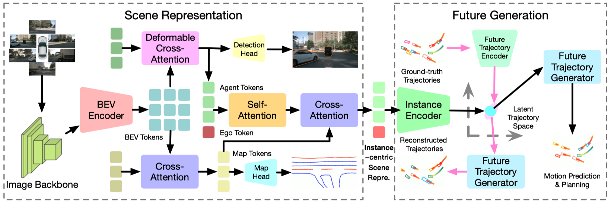

# GenAD: Generative End-to-End Autonomous Driving

### [Paper](https://arxiv.org/pdf/2402.11502)

> GenAD: Generative End-to-End Autonomous Driving

> [Wenzhao Zheng](https://wzzheng.net/)\*, Ruiqi Song\*, [Xianda Guo](https://scholar.google.com/citations?user=jPvOqgYAAAAJ)\*$\ddagger$, [Long Chen](https://scholar.google.com/citations?user=jzvXnkcAAAAJ)$\ddagger$

\* Equal contributions $\ddagger$ Corresponding authors

**GenAD casts autonomous driving as a generative modeling problem.**

## Demo


## Overview


**Comparisons of the proposed generative end-to-end autonomous driving framework with the conventional pipeline.** Most existing methods follow a serial design of perception, prediction, and planning. They usually ignore the high-level interactions between the ego car and other agents and the structural prior of realistic trajectories. We model autonomous driving as a future generation problem and conduct motion prediction and ego planning simultaneously in a structural latent trajectory space.



**Framework of our generative end-to-end autonomous driving.** Given surrounding images as inputs, we employ an image backbone to extract multi-scale features and then use a BEV encoder to obtain BEV tokens. We then use cross-attention and deformable cross-attention to transform BEV tokens into map and agent tokens, respectively. With an additional ego token, we use self-attention to enable ego-agent interactions and cross-attention to further incorporate map information to obtain the instance-centric scene representation. We map this representation to a structural latent trajectory space which is jointly learned using ground-truth future trajectories. Finally, we employ a future trajectory generator to produce future trajectories to simultaneously complete motion prediction and planning.

## Results


## Code 
Code will be released soon!

## Related Projects

Our code is based on [VAD](https://github.com/hustvl/VAD) and [UniAD](https://github.com/OpenDriveLab/UniAD). 

## Citation

If you find this project helpful, please consider citing the following paper:
```
@article{zheng2024genad,
    title={GenAD: Generative End-to-End Autonomous Driving},
    author={Zheng, Wenzhao and Song, Ruiqi and Guo, Xianda and Chen, Long},
    journal={arXiv preprint arXiv: 2402.11502},
    year={2024}
}
```
