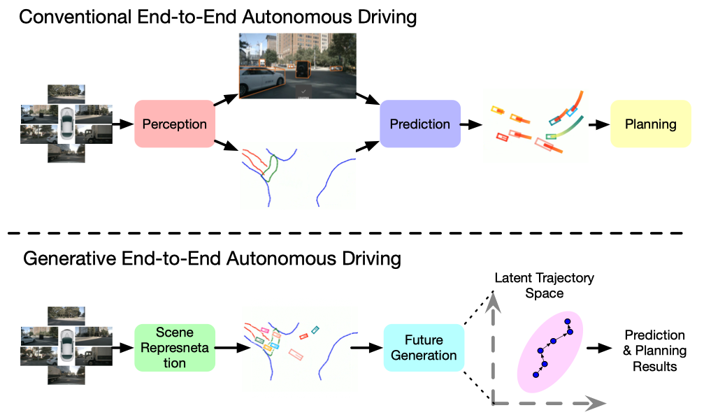
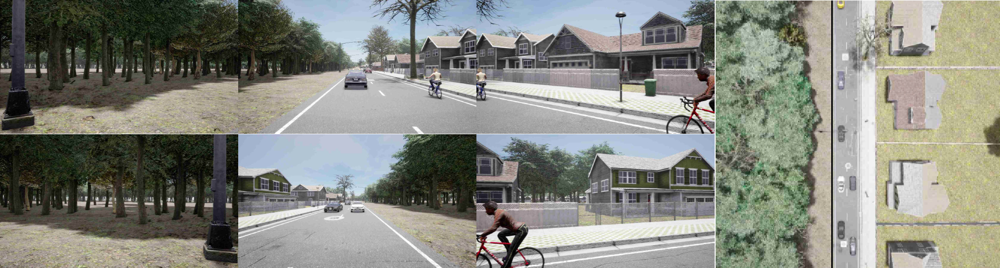
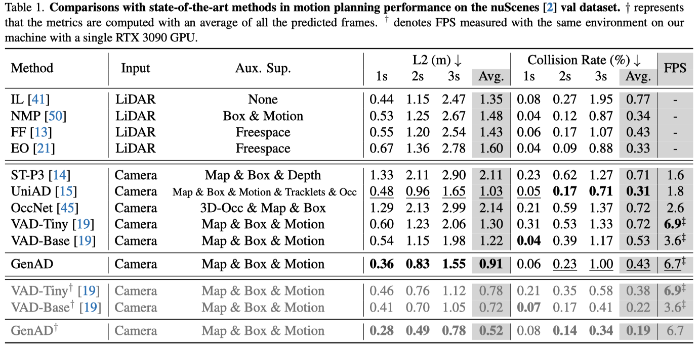

# GenAD: Generative End-to-End Autonomous Driving

### [Paper](https://arxiv.org/pdf/2402.11502)

> GenAD: Generative End-to-End Autonomous Driving

> [Wenzhao Zheng](https://wzzheng.net/)\*, Ruiqi Song\*, [Xianda Guo](https://scholar.google.com/citations?user=jPvOqgYAAAAJ)\* $\dagger$, Chenming Zhang, [Long Chen](https://scholar.google.com/citations?user=jzvXnkcAAAAJ)$\dagger$

\* Equal contributions $\dagger$ Corresponding authors

**GenAD casts autonomous driving as a generative modeling problem.**

## News 

- **[2024/11/10]** Closed-loop code for [GenAD](https://github.com/wzzheng/GenAD) has been released.
- **[2024/5/2]** Training and evaluation code release.
- **[2024/2/18]** Paper released on [arXiv](https://arxiv.org/pdf/2402.11502).

## Demo


## Overview



**Comparisons of the proposed generative end-to-end autonomous driving framework with the conventional pipeline.** Most existing methods follow a serial design of perception, prediction, and planning. They usually ignore the high-level interactions between the ego car and other agents and the structural prior of realistic trajectories. We model autonomous driving as a future generation problem and conduct motion prediction and ego planning simultaneously in a structural latent trajectory space.

### Closed-Loop Autonomous Driving



Bench2Drive comprises the [Bench2Drive](https://github.com/Thinklab-SJTU/Bench2Drive) repository for closed-loop evaluation and the model repository [Bench2DriveZoo](https://github.com/Thinklab-SJTU/Bench2DriveZoo/tree/uniad/vad). The code in this repository integrates GenAD within the Bench2DriveZoo repository, with the majority of the code being identical to that in Bench2DriveZoo. This repository does not contain the code from the Bench2Drive repository, and no modifications were made to the closed-loop evaluation code. Only the execution scripts were adjusted, as detailed in the following description.

## Results

### Open-Loop Setting on nuScenes



### Closed-Loop Setting on Carla

|       Method        | Driving Score | Success Rates (%) |
| :-----------------: | :-----------: | :---------------: |
|     VAD (Paper)     |     39.42     |        0.1        |
| VAD (Github Update) |     42.35     |       0.13        |
| VAD (Reproduction)  |     38.16     |       0.15        |
|      **GenAD**      |   **44.81**   |     **0.159**     |

## Open-Loop Code 

### Dataset

Download nuScenes V1.0 full dataset data and CAN bus expansion data [HERE](https://www.nuscenes.org/download). Prepare nuscenes data as follows.

**Download CAN bus expansion**

```
# download 'can_bus.zip'
unzip can_bus.zip 
# move can_bus to data dir
```

**Prepare nuScenes data**

*We genetate custom annotation files which are different from mmdet3d's*

Generate the train file and val file:

```
python tools/data_converter/genad_nuscenes_converter.py nuscenes --root-path ./data/nuscenes --out-dir ./data/nuscenes --extra-tag genad_nuscenes --version v1.0 --canbus ./data
```

Using the above code will generate `genad_nuscenes_infos_temporal_{train,val}.pkl`.


**Folder structure**

```
GenAD
├── projects/
├── tools/
├── configs/
├── ckpts/
│   ├── resnet50-19c8e357.pth
├── data/
│   ├── can_bus/
│   ├── nuscenes/
│   │   ├── maps/
│   │   ├── samples/
│   │   ├── sweeps/
│   │   ├── v1.0-test/
|   |   ├── v1.0-trainval/
|   |   ├── genad_nuscenes_infos_train.pkl
|   |   ├── genad_nuscenes_infos_val.pkl
```

### Installation

Detailed package versions can be found in [requirements.txt](../requirements.txt).

- [Installation](docs/install.md)

#### Open-Loop Evaluation

**datasets**

https://drive.google.com/drive/folders/1gy7Ux-bk0sge77CsGgeEzPF9ImVn-WgJ?usp=drive_link

**Checkpoints**

https://drive.google.com/drive/folders/1nlAWJlvSHwqnTjEwlfiE99YJVRFKmqF9?usp=drive_link

Train GenAD with 8 GPUs

```shell
cd /path/to/GenAD
conda activate genad
python -m torch.distributed.run --nproc_per_node=8 --master_port=2333 tools/train.py projects/configs/GenAD/GenAD_config.py --launcher pytorch --deterministic --work-dir path/to/save/outputs
```

Eval GenAD with 1 GPU

```shell
cd /path/to/GenAD
conda activate genad
CUDA_VISIBLE_DEVICES=0 python tools/test.py projects/configs/VAD/GenAD_config.py /path/to/ckpt.pth --launcher none --eval bbox --tmpdir outputs
```

## Closed-Loop Code

### Installation

Clone this repository and configure it according to the *Getting Started* section in the [Bench2DriveZoo](https://github.com/Thinklab-SJTU/Bench2DriveZoo/tree/uniad/vad) repository documentation. Refer to the configuration documentation in the [Bench2Drive](https://github.com/Thinklab-SJTU/Bench2Drive)  repository to link this repository to the closed-loop evaluation repository.

Detailed package versions can be found in [requirements.txt](../requirements.txt).


### Training

``` 
sh ./adzoo/genad/dist_train.sh ./adzoo/genad/configs/VAD/GenAD_config_b2d.py 1
```

**Note:** Detailed training and evaluation methods can be found in the documentation of [Bench2DriveZoo](https://github.com/Thinklab-SJTU/Bench2DriveZoo/tree/uniad/vad).

### Open-Loop Evaluation

```
sh ./adzoo/genad/dist_test.sh ./adzoo/genad/configs/VAD/GenAD_config_b2d.py ./work_dirs/GenAD_config_b2d/epoch_.pth 1
```

### Closed-Loop Evaluation

Eval GenAD with 8 GPUs

```shell
leaderboard/scripts/run_evaluation_multi.sh
```

Eval GenAD with 1 GPU

```shell
leaderboard/scripts/run_evaluation_debug.sh
```

**Note:** Detailed training and evaluation methods can be found in the documentation of [Bench2DriveZoo](https://github.com/Thinklab-SJTU/Bench2DriveZoo/tree/uniad/vad).

## Related Projects

Our code is based on [VAD](https://github.com/hustvl/VAD) and [UniAD](https://github.com/OpenDriveLab/UniAD). 

Closed-loop code is based on [Bench2DriveZoo](https://github.com/Thinklab-SJTU/Bench2DriveZoo).

## Citation

If you find this project helpful, please consider citing the following paper:
```
@article{zheng2024genad,
    title={GenAD: Generative End-to-End Autonomous Driving},
    author={Zheng, Wenzhao and Song, Ruiqi and Guo, Xianda and Zhang, Chenming and Chen, Long},
    journal={arXiv preprint arXiv: 2402.11502},
    year={2024}
}
```
